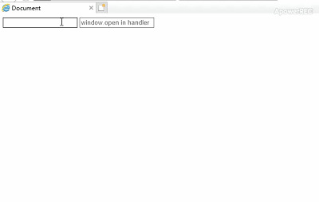

# ISSUE

In IE(9-11), after version of 2.5.14, keyboard event with modifiers and with alert (alse window.open) in handler will fire twice when user is using IME.

I guess that interrupting javascript execution will cause this problem.

Maybe It is a system or browser bug, but i'm not sure.

# Steps to reproduce

1. Open demo.html
2. Use IME
3. Type some letters
4. Press enter of the keyboard

# GIF

